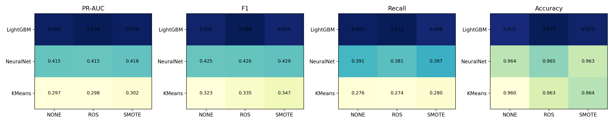
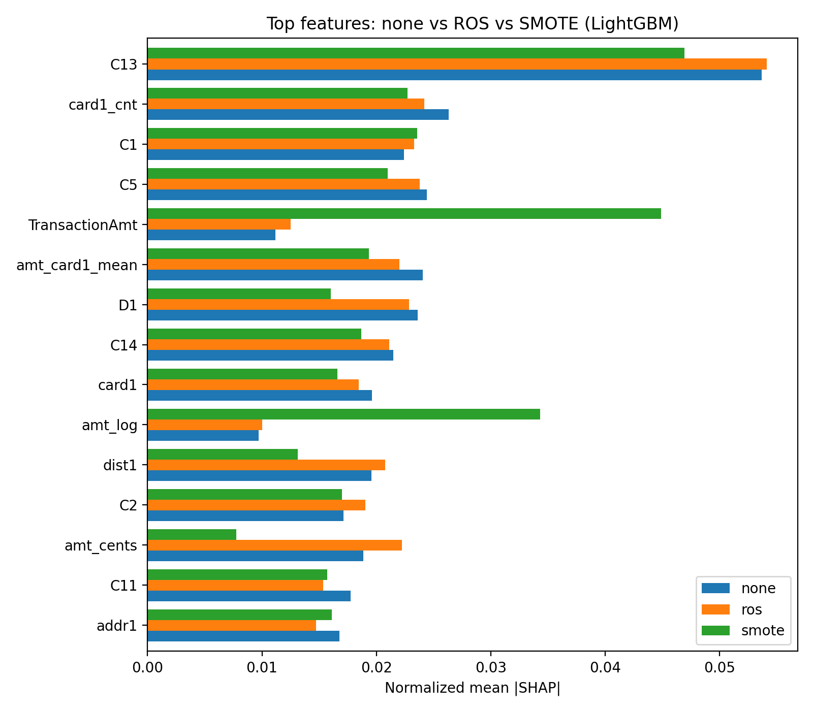

# Resampling and Interpretable Machine Learning for Financial Fraud Detection

A comparative study of **None, ROS, and SMOTE** across three model families — **LightGBM, Feedforward Neural Network, and K-Means** — on the full IEEE-CIS Fraud Detection dataset (590,540 transactions, 3.50% fraud rate).

The study investigates whether resampling improves fraud detection performance and whether it changes model feature reliance. Evaluation uses a chronological **70/10/20 split**, three random seeds, PR-AUC, F1, Recall, Precision, ROC-AUC, and SHAP.

## Problem

Financial fraud detection is a highly imbalanced classification problem, with only 3.50% fraudulent transactions in the IEEE-CIS dataset. Accuracy alone can therefore be misleading.

This project evaluates whether resampling improves fraud detection and whether its impact depends on the model family.

## Research Questions

**RQ1.** Does resampling improve fraud detection performance across different model families?

**RQ2.** Does resampling change the features driving model predictions?

## Methodology

**Preprocessing:** Merge transaction and identity data, remove duplicates and sparse features, and engineer temporal, transaction, categorical, and aggregation features.

**Splitting:** Chronological 70/10/20 train/validation/test split with train-only preprocessing.

**Resampling:** None / ROS / SMOTE (10%), applied only to training data.

**Models:** LightGBM / Feedforward Neural Network / K-Means.

**Experiments:** 3 random seeds for each configuration.

**Interpretability:** SHAP feature-importance analysis for LightGBM.

## Key Findings

**RQ1 — Model choice mattered more than resampling.**  
LightGBM achieved **0.570–0.575 PR-AUC**, compared with **0.415–0.418** for Neural Network and **0.297–0.302** for K-Means. ROS/SMOTE changed LightGBM PR-AUC by only **0.002–0.005**.

  

**RQ2 — Resampling can change feature reliance.**  
ROS preserved **8/10** top features (Jaccard = **0.818**), while SMOTE showed only **0.250** Top-10 Jaccard similarity with the original model.

  

## Tech Stack

Python · pandas · NumPy · scikit-learn · imbalanced-learn · LightGBM · PyTorch · SHAP · Matplotlib · Seaborn
## How to Run
The notebook is written for Kaggle Notebooks (free T4 GPU, dataset attached automatically) but runs in any environment with a CUDA-capable GPU. On Kaggle:

Fork the IEEE-CIS Fraud Detection competition data into your workspace Upload the notebook and attach the dataset Settings, Accelerator, GPU T4 x2 Run all cells

Locally: install requirements.txt, download the IEEE-CIS dataset from Kaggle, update the DATA_PATH variable in Step 2, then run. Full pipeline runtime is approximately 2.5 hours on a single T4 (most of it spent on GCN training).
## References 

**1.**  Baisholan, B., et al. (2025). A Systematic Review of Machine Learning in Credit Card Fraud Detection Under Original Class Imbalance. Computers, 14(10), 437.

**2.** Zhu, et al. (2024). Enhancing Credit Card Fraud Detection: A Neural Network and SMOTE Integrated Approach. arXiv:2402.17979.
